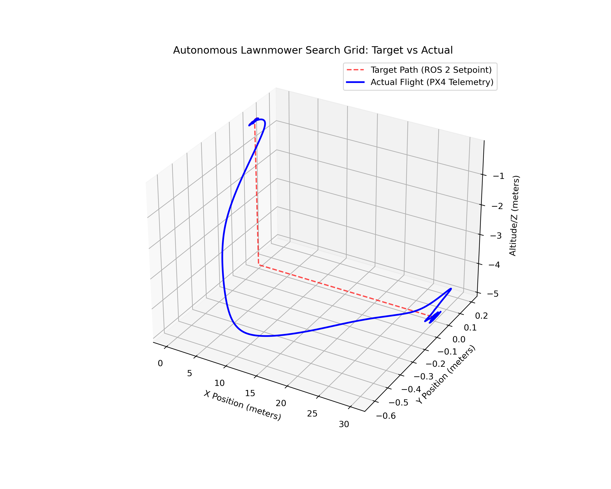

# Autonomous UAV Search Grid Controller (ROS 2 & PX4)

## Overview
This repository contains the software architecture and path-planning logic for an autonomous Unmanned Aerial Vehicle (UAV). Developed as part of a Master's Thesis, this project demonstrates a headless, offboard control system that generates and mathematically verifies a dynamic Boustrophedon (lawnmower) search grid.

The system bypasses standard graphical visualizers to minimize processing overhead, relying on **ROS 2 Humble**, the **PX4 Autopilot**, and **Micro-XRCE-DDS** for deterministic, low-latency telemetry control.

## System Architecture
* **Flight Controller:** PX4 Autopilot (Offboard Mode)
* **Middleware:** ROS 2 Humble & Micro-XRCE-DDS Agent
* **Simulation Environment:** Gazebo (gz_x500 physics model)
* **Data Analytics:** Python (Pandas, Numpy, Matplotlib)

## Key Features
* **Dynamic Setpoint Generation:** Algorithmically calculates 30x30 meter search grids with customizable row spacing and operational altitudes.
* **Zero-Velocity Anchor Bypass:** Implements explicit `NaN` velocity/acceleration casting to prevent internal PX4 PID stalls during offboard positional transits.
* **Automated Data Validation:** Includes a telemetry analysis script (`analyze_flight.py`) that synchronizes ROS 2 setpoint timestamps with PX4 `.ulg` flight diaries to calculate sub-meter RMSE tracking accuracy.

## Results
The flight controller achieves highly stable autonomous tracking, compensating for real-world aerodynamic momentum and inertia during sweeps.


*Red dashed line: ROS 2 Setpoints | Blue solid line: Actual PX4 Flight Telemetry*

## How to Run the Simulation
**1. Start the PX4 Simulator**
```bash
cd PX4-Autopilot
make px4_sitl gz_x500
param set NAV_RCL_ACT 0
